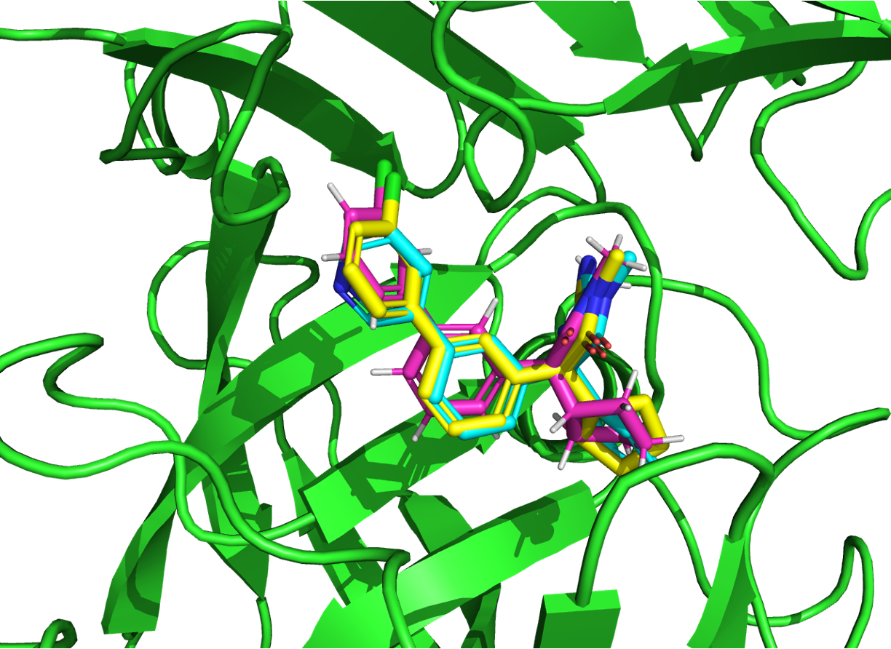

# anchored_docking_workflow

An automated configuration script for anchored docking using AutoDock-GPU.

**Note:** This project is still under development.

## Overview

This script provides a simplified setup for performing anchored docking as described in the [AutoDock-GPU Anchored Docking Guide](https://github.com/ccsb-scripps/AutoDock-GPU/wiki/Anchored-docking). By overlaying ligands that share a core, it functions as an alternative to core-constrained docking.

While this method may be useful for applications like relative binding free energy perturbation calculations, please note that it has not been experimentally validated.

## Environment Setup

The requirements are the same as those listed in the [Anchored Docking Guide](https://github.com/ccsb-scripps/AutoDock-GPU/wiki/Anchored-docking).

   - [RDKit](https://www.rdkit.org/)
   - [Meeko](https://github.com/forlilab/Meeko)
   - [ADFR](https://ccsb.scripps.edu/adfr/downloads/)
   - [AutoDock-GPU](https://github.com/ccsb-scripps/AutoDock-GPU/releases/)
   - [AutoGrid](https://autodock.scripps.edu/download-autodock4/)
   - Download and extract `scripts.zip` from the [Anchored Docking Guide](https://github.com/ccsb-scripps/AutoDock-GPU/wiki/Anchored-docking).

## Usage

As a test case, we provide an anchored docking tutorial for the Bace1 receptor.

Run the following command:

```bash
python anchored_docking.py \
    --template_file test/crystal_ligand.sdf \
    --input_file test/CAT-13f.sdf \
    --receptor_file test/Bace1_protein.pdb \
    --docking_dir test/output
```


